## Systolic Blood Pressure

### Crossover Experimental Design
We will start exploratory analysis by plotting box plots of Systolic Blood Pressure (SBP) for each period and grouped by drug.

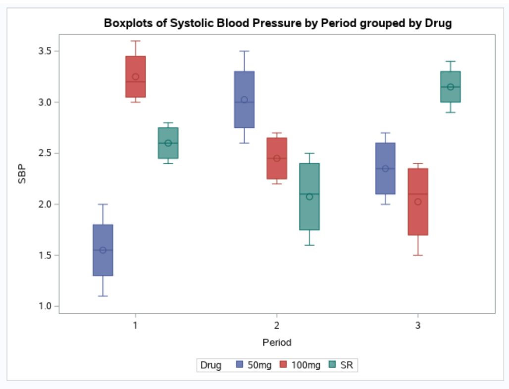

There are couple of interesting trends we can see. For instance, the 100-milligram tablet has the highest SBP initially; however, with each consecutive period the mean is getting smaller. It looks as if there was a negative trend. Then, we have two shifting trends for 50-miligram tablet and sustained-release capsule. In the first period, the mean for 50-miligram tablet is smaller compare to sustained-release capsule. Moving into the second period there is a switch in means between the two drugs followed yet by another switch in the last period. Thus, the 50-miligram tablet has increasing-decreasing trend while sustained-release capsule the opposite decreasing-increasing trend.

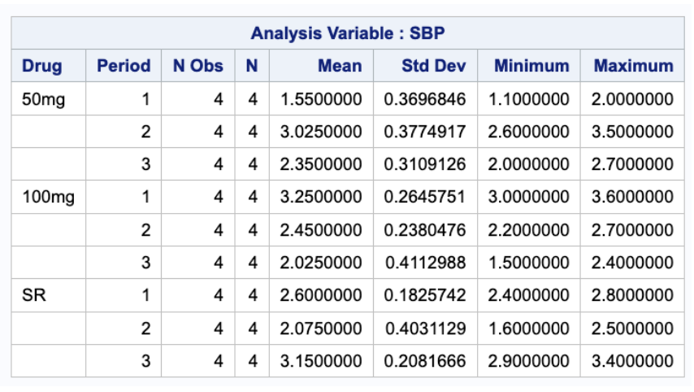

The table is a numerical summary of the boxplots above. For instance, the minimum value for SBP was reported in first period for 50-miligram tablet. On the other hand, the highest value for SBP can be found again in the first period but this time for 100-miligram tablet.

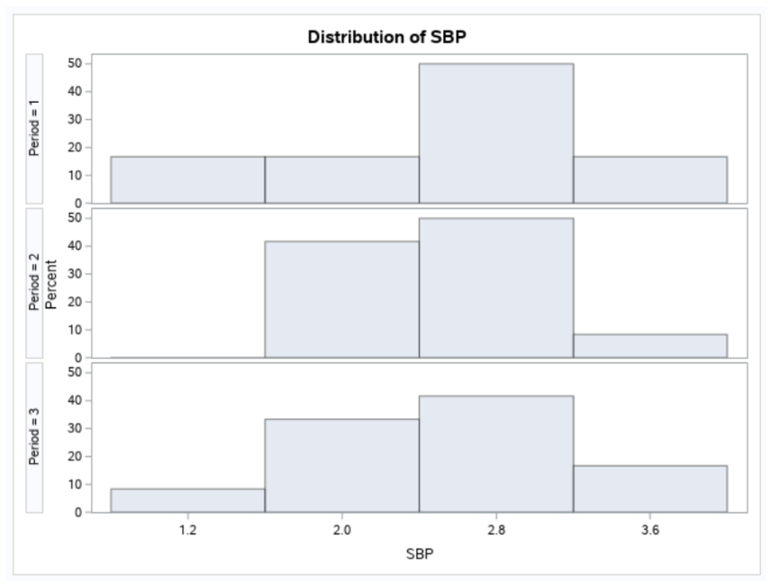

We will conclude our exploratory analysis with histograms depicting each period. The most symmetric in shape is histogram for period three. On the other hand, a slight skewness is observed in the first histogram.

For the main analysis, we will perform balanced cross-over design. This will allow us to explore and find if there is an effect from drug, period, or sequence among other things. However, before we proceed, let us look at the variance for each individual factor.

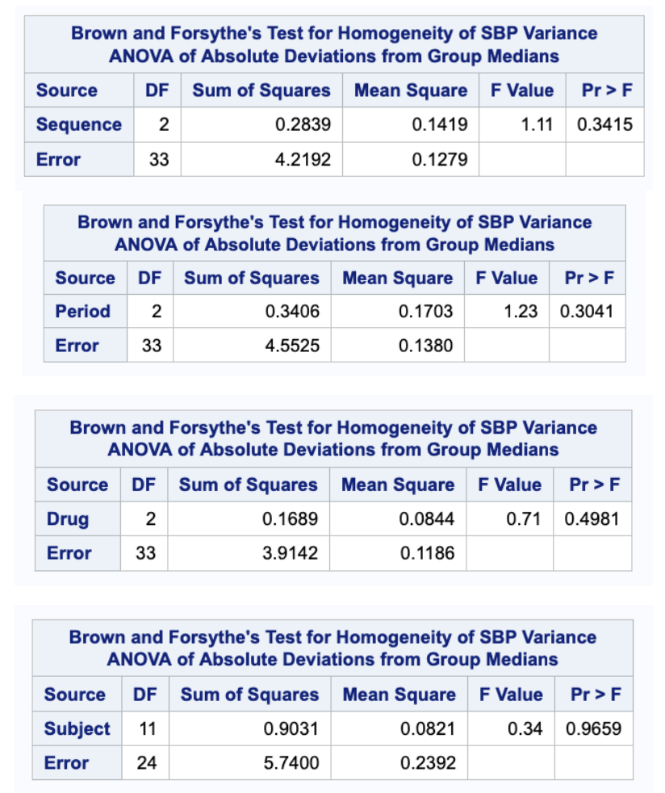

Since our sample is relatively small, we will use Brown and Forsythe test for variance. Our null hypothesis for each 4 tables above has the following form.

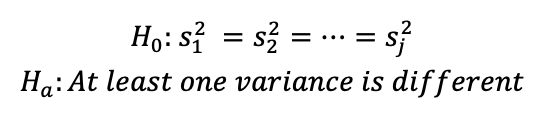

Where j depends on the table. With alpha of 0.05, the variance test for each factor is statistically insignificant meaning we have a strong argument to claim that the variance is homogenous for each variable.

Before we look at the numbers let us define possible factors which might have effect on systolic blood pressure. 

**Sequence** the order in which we apply the treatment can have an effect on SBP. In our experiment, we have three types of sequence: S1=(T1-T2-T3); S2=(T3-T1-T2); and 
S3=(T2-T3-T1).

**Drug** the type of drug we apply to experimental subjects can have an effect on SBP. In our design, we have three types of drug: 10-miligram tablet; 100-miligram tablet; and sustained-release capsule (SR).

**Period** time effect when the treatment was applied can have an effect on the result.

**Subjects within Sequence** depending which randomly selected subjects were assigned to the sequence can influence our results.

**Treatment Carry Over Effect** each treatment can influence or carry over the effect on the subsequent treatments.

With our main effects defined, let us look at the results.

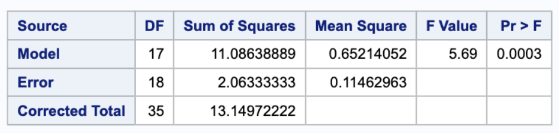

The first table focuses on combined effect from all the factors defined above. It checks if all the effects are non-significant. With alpha level of 0.05, we reject the null hypothesis and conclude that there is at least one factor which is statistically significant (we don’t know which one).

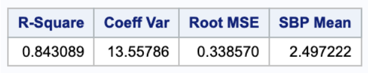

Also, our model can explain roughly 84% of variance in the data.

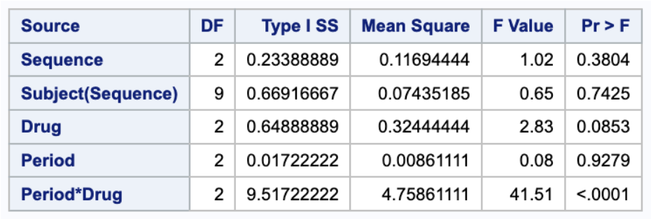

With the next table, we can look in more detail at each factor. Since our design is balanced, we will look at type one sum of squares. With all the factors defined above, only the carry over effect is statistically significant using alpha of 0.05.

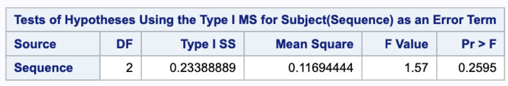

In addition, we see that the effect of subjects on the sequence itself is not statistically significant with p-value of 0.2595 and alpha equal to 0.05.

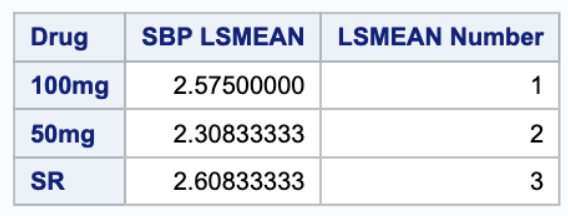

Next, while the drug was statistically insignificant, we can still observe that 50-miligram tablet has the lowest least square mean whereas the sustained-release capsule the highest. Nevertheless, those differences are insignificant for systolic blood pressure.

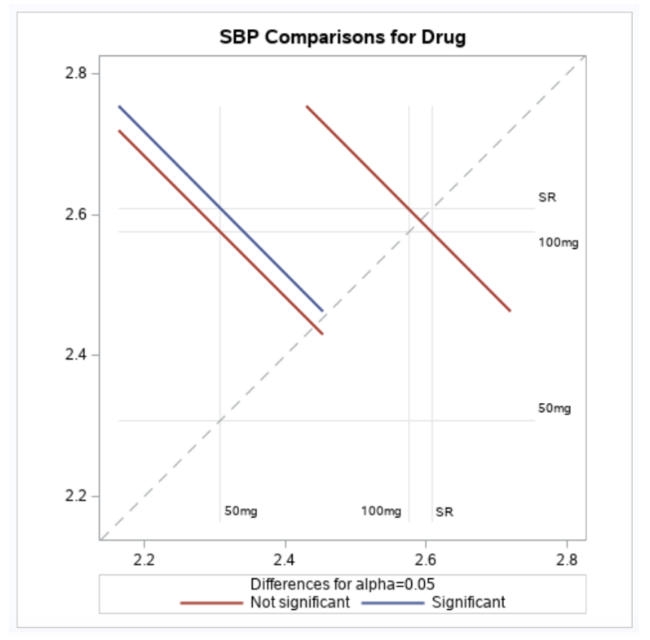

The above plot nicely depicts least square means for each drug with 95% confidence intervals. The interesting part is the difference between 100-miligram and 50-miligram tablet. It was almost on the edge of being statistically significant which might change the significance of the factor.

For completeness, we will include least square means for time periods.

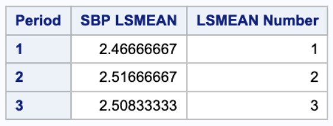

Here all the means are very close to each other, and so, it is clear that the period effect is statistically insignificant.

To conclude, after making sure that the variance is homogenous for each singular factor, we carried out the crossover design. Out of all the available factors only the carry over effect had statistically significance on systolic blood pressure. Even though, our initial exploratory analysis suggested a trend for drug factor, the numerical results stated that the differences between various drug levels are not statistically significant.

